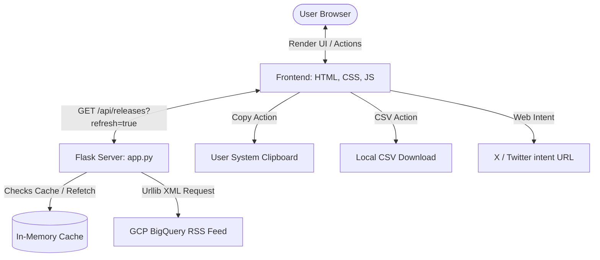

# BigQuery Release Notes Explorer

A modern, high-performance web dashboard built to browse, search, filter, and share Google Cloud BigQuery release notes. The application connects directly to the official Google Cloud Platform Atom feed, segments grouped updates on a day-level basis, and provides interactive tools for copying contents or posting directly on X (Twitter).

```
bq_release_viewer/
├── app.py                  # Python Flask server & XML parsing logic
├── requirements.txt        # Python dependency manifest
├── .gitignore              # Ignores local environments, caches, and OS files
├── README.md               # Project documentation guide
├── templates/
│   └── index.html          # Semantic HTML5 user interface layout
└── static/
    ├── css/
    │   └── style.css       # Custom stylesheets (Dark & Light themes)
    └── js/
        └── app.js          # Client-side render, filtering, search, and sharing logic
```

---

## ⚡ Core Features

*   **Granular Item Splitting**: Google's Atom feed packs all release items on a single day into a single feed item. The server segments these entries by `<h3>` tags, exposing every feature, announcement, or bug fix as a standalone card.
*   **Search & Multi-Filters**: Instant client-side text query search across dates, categories, and descriptions. Filter updates instantly by categories (*Features*, *Announcements*, *Issues*, *Breaking*, *Changes*, *Deprecations*).
*   **Tweet Composer Drawer**: Select a card to draft a custom tweet with active hashtag toggle chips. The counter calculates X's 280-character limit dynamically by wrapping URLs to their standard 23-character `t.co` limit.
*   **Copy to Clipboard (Secure Fallback)**: Copies formatted card contents (Category, Date, Text, and Reference URL) to the clipboard. Includes fallback checks for non-secure contexts (`http` IP endpoints) running synchronously to prevent browser user-gesture blocks.
*   **Export to CSV**: Converts the currently filtered/searched list of release items into a standard downloadable CSV file (correctly escaping fields). Files are named dynamically (e.g. `bigquery_release_notes_feature.csv`).
*   **In-Memory Server Caching**: Feed items are cached in-memory on the Flask backend for 5 minutes (300 seconds) to prevent rate-limiting, with a force-refresh trigger option.

---

## 🏗️ Architecture & Data Flow



---

## 🛠️ Installation & Setup

### Prerequisites
*   Python 3.10 or higher installed.

### 1. Clone the Repository
```bash
git clone https://github.com/IvanLXY04/IvanLXY04-event-talks-app.git
cd IvanLXY04-event-talks-app
```

### 2. Set Up a Virtual Environment
**Windows (PowerShell)**:
```powershell
python -m venv .venv
.\.venv\Scripts\Activate.ps1
```

**macOS/Linux**:
```bash
python3 -m venv .venv
source .venv/bin/activate
```

### 3. Install Dependencies
```bash
pip install -r requirements.txt
```

### 4. Run the Application
```bash
python app.py
```
Open your browser and navigate to:
👉 **[http://127.0.0.1:5000](http://127.0.0.1:5000)**

---

## 🔒 Clipboard Gesture Security Notes
Modern web browsers require clipboard modifications to occur strictly inside a synchronous event call stack stemming from a direct user action (like a `click` event). 

To ensure the clipboard functionality works even on non-localhost/non-secure endpoints:
1.  We perform a synchronous check: `navigator.clipboard && window.isSecureContext`.
2.  If the check returns true, we invoke the modern asynchronous `navigator.clipboard.writeText()` API.
3.  If false (such as in local IP testing networks), we bypass asynchronous promise ticks entirely and execute a synchronous `document.execCommand('copy')` fallback within the initial click thread, preventing the browser from blocking the operation.
